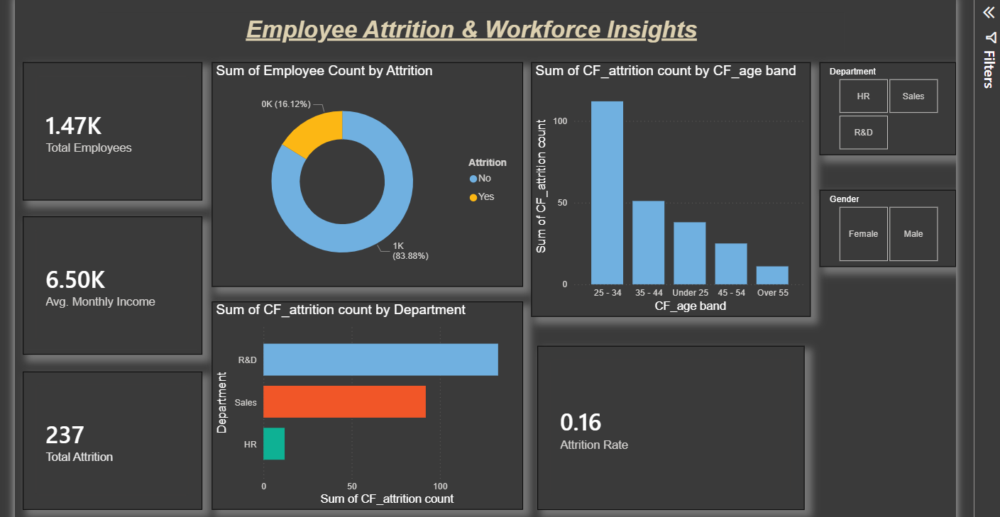

# HR Analytics Dashboard — Power BI

## Project Overview
An HR Analytics dashboard built in Power BI to analyze employee attrition,
department trends, and workforce insights.

## Key Insights
- Total employees: 1,470
- Attrition rate: .16%
- R&D department has the highest attrition
- Age group 25–34 leaves most often

## Files
- `HR_dashboard.pbix` — Power BI dashboard file
- `HR_DATA_Excel.xlsx` — Raw dataset
- `dashboard_screenshot.png` — Preview image
 ## 🛠 Tools Used
- Microsoft Power BI Desktop
- Microsoft Excel

## 📸 Dashboard Preview

